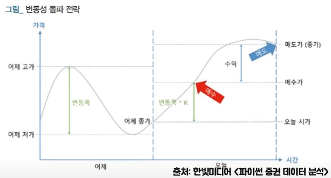

# 업비트 API를 사용한 비트코인 투자 자동화

> **<h3>투자전략</h3>**
- ## 변동성 돌파 전략 (래리 윌리암스)
  -  
  - 래리 윌리엄스(Larry R. Williams)가 사용했던 전략 중 하나로 일일 단위로 일정 수준 이상의 범위를 뛰어넘는 강한 상승세를 돌파 신호로 파악하여 상승하는 추세를 따라가며 __일 단위로__ 빠르게 수익을 실현
  - 또한, 일 단위로 이루어지는 청산 과정은 급작스러운 낙폭에 대한 리스크를 최소화하여 안정적인 우상향을 가능
  - 변동성 돌파 전략은 변동성이 큰 시장일수록 '단기적 추세'가 뚜렷이 나타나 빼어난 성과를 기록
  - 어제 기준 가장 낮은 저가와 가장 높은 고가의 변동폭을 기준으로 오늘 시작 가격의 그 변동폭의 K배 만큼 상승시 돌파 신호로 판단하고 매수하고 하루가 끝나면 매도

- ## Prophet (시계열 예측)
  - 페이스북에서 만든 시계열 분석/예측 라이브러리로 시간에 따른 데이터를 의미
  - 이 알고리즘을 통해 매수를 진행하는 시점에서 미래 가격 예측을 하고 당일 종가에 실제로 매수가보다 높을지를 예측해서 매수가가 높은 경우에만 매수

- ## 나의 전략
  - __bitcoinAISlack.py__ 파일을 사용하여 진행하며 AI와 Slack, BestK을 구하는 최적의 전략
  - 매시간 원하는 종목의 일주일간 데이터를 기반으로 백테스팅을 진행하여 가장 좋은 k값을 조절하고 AI(Prophet)를 통해 당일 종가 가격 예측.. (Slack으로 전송)
  - 시작시간(09:00)부터 종료시간전까지 __매수 목표값보다 현재 가격이 높고 현재 가격보다 당일 종가 가격이 높다면__ 매수
  - 종료시간이 되면 모든 코인을 매도
  - __수정필요__ : 시작시간과 종료시간을 측정하여 최적의 시간을 예측 코드 하나 작성

> **<h3>파일 구성</h3>**

|파일명|내용|
|:--:|:--:|
|test.py|잔고 조회 코드|
|backtest.py|백테스팅 코드|
|bestK.py|가장 좋은 k 값을 찾는 코드|
|bitcoinAutoTrade.py|변동성 돌파 전략 비트코인 자동매매 코드|
|bitcoinAutoTradeWithAI.py|변동성 돌파 전략 + 인공지능(Prophet) 비트코인 자동매매 코드|
|bitcoinAutoTradeWithMA.py|변동성 돌파 전략 + 15일 이동평균선 이상 비트코인 자동매매 코드|
|bitcoinAutoTradeWithSlack.py|위 코드에 슬랙 붙여 놓은 것|
|__bitcoinAISlack.py__|AI와 Slack을 조합한 코드 (사용중)|

> **<h3>기타 참조</h3>**
### 사용 환경 : Prophet, visual studio code, 파이썬 3.8.9-64bit, AWS_console, Slack...
### 참조 강의 : [조코딩 채널](https://www.youtube.com/c/조코딩JoCoding/videos)
### 참고 문헌 : [파이썬을 이용한 비트코인 자동매매](https://wikidocs.net/book/1665) - 저자 : 조대표
### 추가 설명 : [기존 내용 및 가이드](https://github.com/Goaway-1/BitCoinAutoSystem/blob/master/Source/Info.md)
### 추후 참조 : [1번](https://wellsw.tistory.com/m/143) , 시간을 건드는 get_start_time 수정 예정
